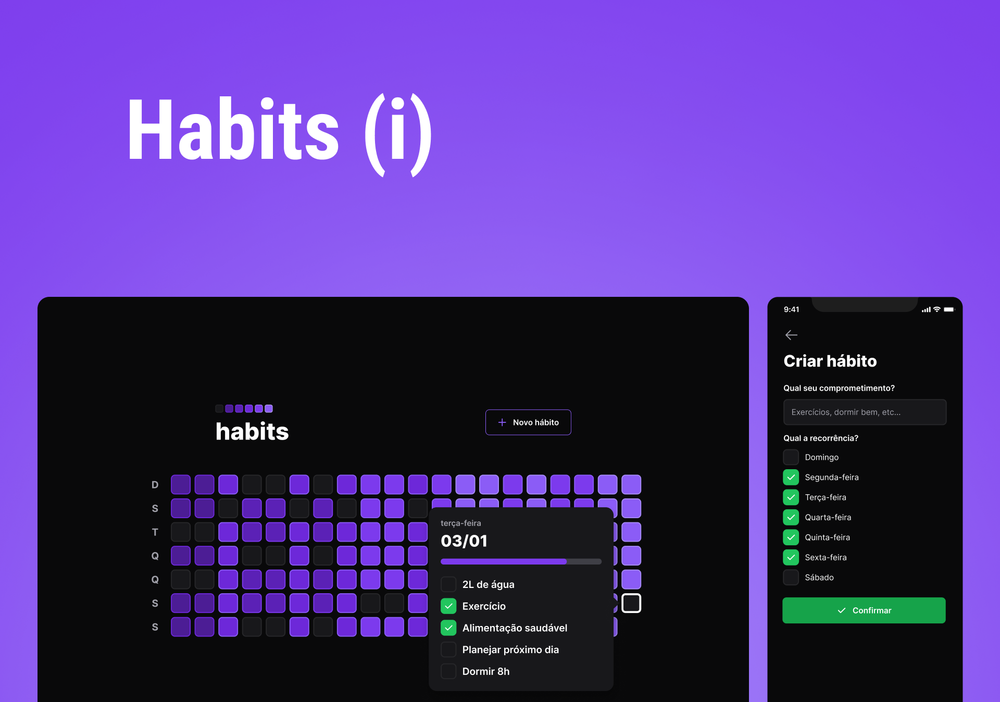

<h1 align="center">
  
</h1>

<h1 align="center">
  
</h1>

# Sobre o projeto

<p>
  Habits é um app para ajudar aos usuários a organizar sua rotina. Criar hábitos e dar aquela forcinha para conclui-lás.
</p>

# Tecnologias

- [Vite](https://vitejs.dev/)
- [ReactJs](https://reactjs.org/)
- [TypeScript](https://www.typescriptlang.org/)
- [Phosphor React](https://github.com/phosphor-icons/phosphor-react)
- [Dayjs](https://day.js.org/)
- [Radix-ui](https://www.radix-ui.com/)
- [Tailwindcss](https://tailwindcss.com/)

## Como baixar o projeto

```bash
# Clonar o repositório
$ git clone https://github.com/wellingtonrodriguesbr/my-habits.git

# Entrar no diretório
$ cd my-habits


# Instalar as dependências
$ npm install

# Rodar o projeto
$ npm run dev
```

<br/>
<hr/>

<p align="center">Desenvolvido por <a href="https://www.linkedin.com/in/wellingtonrodriguesbr/" target="_blank">Wellington Rodrigues</a> ✌🏽</p>
